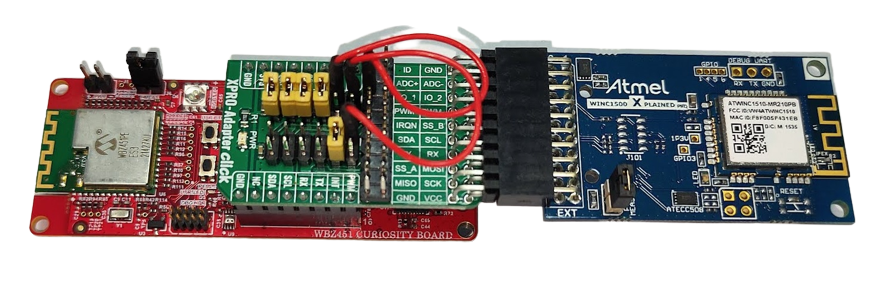
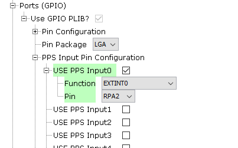
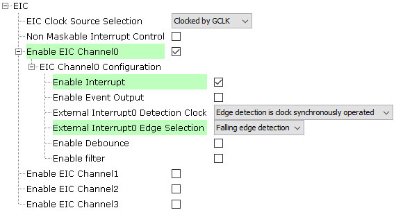
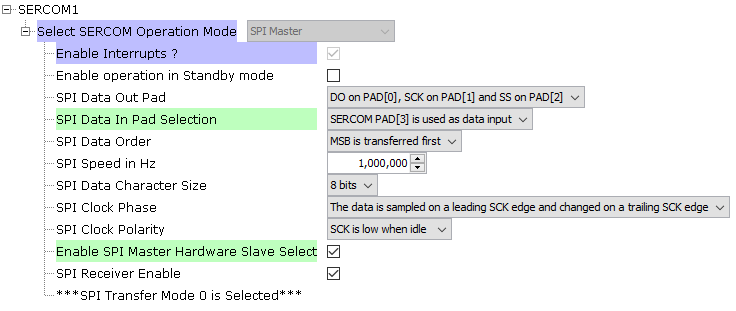
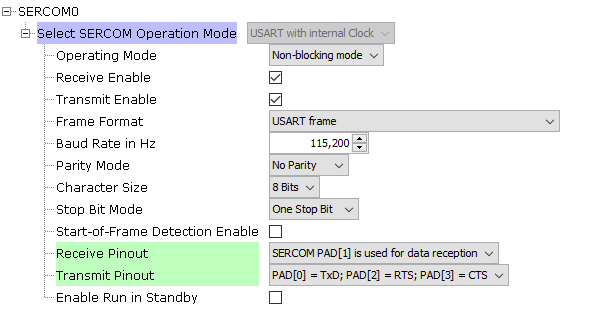

# PIC32CXBZ2_WBZ45x_BLE_WINC1500_SERIAL_BRIDGE

> "Wireless Made Easy!" - This example demonstrates the firmware update of the ATWINC15x0 with the WBZ451 Curiosity board

Devices: **| PIC32CXBZ2 | WBZ45x |** 
Features: **| BLE | Wi-Fi |**

[Back to Main page](../README.md)

## ⚠ Disclaimer

<b>
THE SOFTWARE ARE PROVIDED "AS IS" AND GIVE A PATH FOR SELF-SUPPORT AND SELF-MAINTENANCE. This repository contains example code intended to help accelerate client product development.  

For additional Microchip repos, see: <a href="https://github.com/Microchip-MPLAB-Harmony" target="_blank">https://github.com/Microchip-MPLAB-Harmony</a>

Checkout the <a href="https://microchipsupport.force.com/s/" target="_blank">Technical support portal</a> to access our knowledge base, community forums or submit support ticket requests.

</b>

## Contents

1. [Introduction](#step1)
1. [Bill of materials](#step2)
1. [Hardware Setup](#step3)
1. [Software Setup](#step4)
1. [Harmony MCC Configuration](#step5)
1. [Run the demo](#step6)

## 1. Introduction<a name="step1">

The Serial Bridge example is used to upgrade WINC1500 firmware. The WINC device is connected to WBZ451 through SPI interface, so upgrading the WINC serial flash via the WBZ451 would be an easier solution. The Serial Bridge application acts as a simple bridge between computer and WINC Device by passing commands received from computer to DUT and by passing the response from DUT to PC.

The WBZ451 running the serial bridge firmware is connected between computer and WINC SPI to download the firmware to WINC serial flash.

## 2. Bill of materials<a name="step2">

|**Tools**|**Quantity**|
| :- | :- |
|[WBZ451 Curiosity Evaluation Kit](https://www.microchip.com/DevelopmentTools/ProductDetails/PartNO/EA71C53A)|1|
|[WINC1500 Xplained Pro](https://www.microchip.com/en-us/product/ATWINC1500)|1|
|[XPRO-ADAPTER  Click](https://www.mikroe.com/xpro-adapter-click)|1|

## 3. Hardware Setup<a name="step3">

- Connect the WBZ451 Curiosity Evaluation Kit to the Host PC as a USB Device through a Type-A male to micro-B USB cable connected to Micro-B USB (Debug USB) port
- Connect WINC1500 Xplained Pro and WBZ451 Curiosity board as below

|WBZ451 Click connector|WBZ451 Pin name/Number|WINC1500 Xplained Pro|WINC1500 Pin Name/Number|
| :- | :- | :- | :- |
|1|PB1|10|CHIP EN|
|2|PB2|5|RST|
|3|PA9|15|SPI CS|
|4|PA8|18|SPI CLK|
|5|PA10|17|SPI\_MISO|
|6|PA7|16|SPI\_MOSI|
|7|Vcc|20|+3.3V|
|8|GND|19|GND|
|15/16|PA2|9|IRQN (In V2 board, connect to 16)|

- WBZ451 Curiosity board can be connected to WINC1500 Xplained Pro using a [XPRO-ADAPTER  Click](https://www.mikroe.com/xpro-adapter-click) as shown below.\

  - The jumper settings in XPRO-ADAPTER click board is as shown above figure. Use Jumpers and Jumper wires to connect the header as mentioned in below table.

	|Jumper Connections|
	| :- |
	|J3.1 &emsp; to &emsp; J4.1 |
	|J3.3 &emsp; to &emsp; J1.5 |
	|J3.5 &emsp; to &emsp; J3.6 |
	|J3.7 &emsp; to &emsp; J3.8 |
	|J3.9 &emsp; to &emsp; J3.10|
	|J3.11&emsp; to &emsp; J3.12|
	|J4.1 &emsp; to &emsp; J3.1 |
	|J4.3 &emsp; to &emsp; J4.4 |
	|J4.6 &emsp; Open |
	|J4.8 &emsp; Open |
	|J4.10&emsp; Open |
	|J4.12&emsp; Open |
	

## 4. Software Setup<a name="step4">

This project has been verified to work with the following versions of software tools:

- MPLAB X IDE v6.00
- XC32 Compiler v4.10
- MPLAB® Code Configurator v5.1.9
- PIC32CX-BZ\_DFP v1.0.107
- MCC Harmony
  - csp version: v3.11.0
  - core version: v3.10.0
  - wireless\_wifi version: v3.6.1
  - dev\_packs version: v3.11.2
  - CMSIS-FreeRTOS version: v10.3.1

Refer Project Manifest present in harmony-manifest-success.yml under the project folder *firmware\src\config\default\harmony-manifest-success.yml* for more details

Because Microchip regularly update tools, occasionally issue(s) could be discovered while using the newer versions of the tools. If the project doesn’t seem to work and version incompatibility is suspected, It is recommended to double-check and use the same versions that the project was tested with. To download original version of MPLAB Harmony v3 packages, refer to document [How to Use the MPLAB Harmony v3 Project Manifest Feature](https://microchip.com/DS90003305)

## 5. Harmony MCC Configuration<a name="step5">

- The "MCC - Harmony Project Graph" below depicts the harmony components utilized in this project.\

- The system configuration is depicted as follows.\
\

- The EIC configuration is depicted as follows.\

- The WINC configuration is depicted as follows.\

- The SPI Driver configuration is depicted as follows.\

- The SERCOM1 SPI configuration is depicted as follows.\

- The SERCOM0 UART configuration is depicted as follows.\

- The PIN configuration is depicted as follows.\

## 6. Run the demo<a name="step6">

- WINC device firmware can be upgraded by executing the batch script *winc_flash_tool.cmd* that is available in the wireless\_wifi repo.

- In the wireless\_wifi repo, navigate to the folder *wireless\_wifi/utilities/wifi/winc* in command prompt.
- Execute the command winc_flash_tool.cmd /p <COMx> /d WINC1500 /v <firmware version number> /e /x /i aio /w
	- e.g. winc_flash_tool.cmd /p COM20 /d WINC1500 /v 19.7.6 /e /x /i aio /w
		- where COM20 is the comport 20
		- 19.7.6 : is the firmware version number that is to be updated. For a list of the firmware versions that are available, look in the folder. *wireless\_wifi/utilities/wifi/winc/files/winc1500*

- For more details on Firmware update procedure, please visit the page <https://microchip-mplab-harmony.github.io/wireless_apps_winc1500/apps/getting_started/winc_firmware_upgrade.html>

* Note:
	- Ensure that RTS & CTS is enabled. If not enable RTS& CTS using MCP2200 Configuration Utility as shown in below figure.\
	
	- Ensure that external power supply is used to power the board as WBZ451 Curiosity Board may not source enough power during WINC1500 Flash programming.
	
<a href="#top">Back to top</a>

