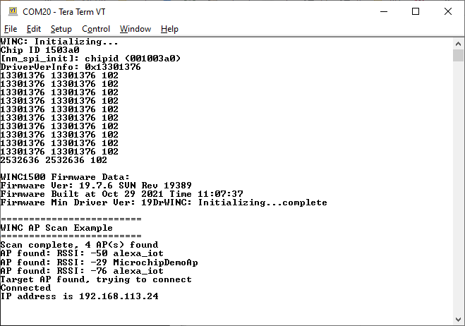

# PIC32CXBZ2_WBZ45x_BLE_WINC1500_AP_SCAN

> "Wireless Made Easy!" - This example demonstrates the use of the ATWINC15x0 with the WBZ451 Curiosity board to explain how to scan for an AP when running as a station

Devices: **| PIC32CXBZ2 | WBZ45x |** 
Features: **| BLE | Wi-Fi |**

[Back to Main page](../README.md)

## ⚠ Disclaimer

<b>
THE SOFTWARE ARE PROVIDED "AS IS" AND GIVE A PATH FOR SELF-SUPPORT AND SELF-MAINTENANCE. This repository contains example code intended to help accelerate client product development.  

For additional Microchip repos, see: <a href="https://github.com/Microchip-MPLAB-Harmony" target="_blank">https://github.com/Microchip-MPLAB-Harmony</a>

Checkout the <a href="https://microchipsupport.force.com/s/" target="_blank">Technical support portal</a> to access our knowledge base, community forums or submit support ticket requests.

</b>

## A la carte

1. [Introduction](#step1)
1. [Bill of materials](#step2)
1. [Hardware Setup](#step3)
1. [Software Setup](#step4)
1. [Harmony MCC Configuration](#step5)
1. [Run the demo](#step6)

## 1. Introduction<a name="step1">

This example demonstrates the use of the ATWINC15x0 with the WBZ451 Curiosity board to explain how to scan for an AP when running as a station.

## 2. Bill of materials<a name="step2">

|**Tools**|**Quantity**|
| :- | :- |
|[WBZ451 Curiosity Evaluation Kit](https://www.microchip.com/DevelopmentTools/ProductDetails/PartNO/EA71C53A)|1|
|[WINC1500 Xplained Pro](https://www.microchip.com/en-us/product/ATWINC1500)|1|
|[XPRO-ADAPTER  Click](https://www.mikroe.com/xpro-adapter-click)|1|

## 3. Hardware Setup<a name="step3">

- Connect the WBZ451 Curiosity Evaluation Kit to the Host PC as a USB Device through a Type-A male to micro-B USB cable connected to Micro-B USB (Debug USB) port
- Connect WINC1500 Xplained Pro and WBZ451 Curiosity board as below

|WBZ451 Click connector|WBZ451 Pin name/Number|WINC1500 Xplained Pro|WINC1500 Pin Name/Number|
| :- | :- | :- | :- |
|1|PB1|10|CHIP EN|
|2|PB2|5|RST|
|3|PA9|15|SPI CS|
|4|PA8|18|SPI CLK|
|5|PA10|17|SPI\_MISO|
|6|PA7|16|SPI\_MOSI|
|7|Vcc|20|+3.3V|
|8|GND|19|GND|
|15/16|PA2|9|IRQN (In V2 board, connect to 16)|

## 4. Software Setup<a name="step4">

This project has been verified to work with the following versions of software tools:

- MPLAB X IDE v6.00
- XC32 Compiler v4.10
- MPLAB® Code Configurator v5.1.9
- PIC32CX-BZ\_DFP v1.0.107
- MCC Harmony
  - csp version: v3.11.0
  - core version: v3.10.0
  - wireless\_wifi version: v3.6.1
  - dev\_packs version: v3.11.2
  - CMSIS-FreeRTOS version: v10.3.1

Refer Project Manifest present in harmony-manifest-success.yml under the project folder *firmware\src\config\default\harmony-manifest-success.yml* for more details

- Any Serial Terminal application like Tera Term terminal application.
	- configure the serial settings as follows:
		- Baud : 115200
		- Data : 8 Bits
		- Parity : None
		- Stop : 1 Bit
		- Flow Control : None

Because Microchip regularly update tools, occasionally issue(s) could be discovered while using the newer versions of the tools. If the project doesn’t seem to work and version incompatibility is suspected, It is recommended to double-check and use the same versions that the project was tested with. To download original version of MPLAB Harmony v3 packages, refer to document [How to Use the MPLAB Harmony v3 Project Manifest Feature](https://microchip.com/DS90003305)

## 5. Harmony MCC Configuration<a name="step5">

The "MCC - Harmony Project Graph" below depicts the harmony components utilized in this project.\

## 6. Run the demo<a name="step6">

- Make sure the WINC1500 firmware is v19.7.6 or higher. Please refer to the documentation in the [WBZ451 serial bridge project](../01_wbz45x_winc1500_serialBridge/README.md#step1) to update the WINC1500 firmware.
- Open the Tera Term terminal application on your PC (from the Windows® Start menu by pressing the Start button)
- Choose USB Serial Com Port and Set the baud rate to 115200
- Press the switch Reset on the WBZ451 Curiosity Evaluation Kit to print the console logs.

<a href="#top">Back to top</a>

