# PIC32CXBZ2_WBZ45x_BLE_WINC1500_WIFI_PROVISIONING

> "Wireless Made Easy!" - This example demonstrates the use of the ATWINC15x0 with the WBZ451 Curiosity board to enable Wi-Fi provisioning over a BLE connection

Devices: **| PIC32CXBZ2 | WBZ45x |** 
Features: **| BLE | Wi-Fi |**

[Back to Main page](../README.md)

## ⚠ Disclaimer

<b>
THE SOFTWARE ARE PROVIDED "AS IS" AND GIVE A PATH FOR SELF-SUPPORT AND SELF-MAINTENANCE. This repository contains example code intended to help accelerate client product development.  

For additional Microchip repos, see: <a href="https://github.com/Microchip-MPLAB-Harmony" target="_blank">https://github.com/Microchip-MPLAB-Harmony</a>

Checkout the <a href="https://microchipsupport.force.com/s/" target="_blank">Technical support portal</a> to access our knowledge base, community forums or submit support ticket requests.

</b>

## Contents

1. [Introduction](#step1)
1. [Bill of materials](#step2)
1. [Hardware Setup](#step3)
1. [Software Setup](#step4)
1. [Harmony MCC Configuration](#step5)
1. [Run the demo](#step6)

## 1. Introduction<a name="step1">

This example demonstrates how to pass the AP credentials to WINC1500 device via BLE of WBZ451.

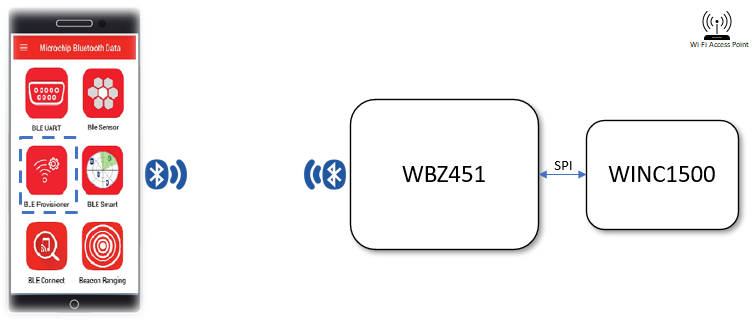

This application shows how a user can use the WBZ451's BLE to send the target AP credentials to a WINC1500 device. After pairing with the smart phone, the user can use the "Microchip Bluetooth Data" mobile application to send the AP credentials to the WINC1500 via BLE Custom service created in WBZ451 device.

## 2. Bill of materials<a name="step2">

|**Tools**|**Quantity**|
| :- | :- |
|[WBZ451 Curiosity Evaluation Kit](https://www.microchip.com/DevelopmentTools/ProductDetails/PartNO/EA71C53A)|1|
|[WINC1500 Xplained Pro](https://www.microchip.com/en-us/product/ATWINC1500)|1|
|[XPRO-ADAPTER  Click](https://www.mikroe.com/xpro-adapter-click)|1|
|Apple® iPhone|1|
|Wi-Fi Access Point|1|

## 3. Hardware Setup<a name="step3">

- Connect the WBZ451 Curiosity Evaluation Kit to the Host PC as a USB Device through a Type-A male to micro-B USB cable connected to Micro-B USB (Debug USB) port
- Connect WINC1500 Xplained Pro and WBZ451 Curiosity board as below

|WBZ451 Click connector|WBZ451 Pin name/Number|WINC1500 Xplained Pro|WINC1500 Pin Name/Number|
| :- | :- | :- | :- |
|1|PB1|10|CHIP EN|
|2|PB2|5|RST|
|3|PA9|15|SPI CS|
|4|PA8|18|SPI CLK|
|5|PA10|17|SPI\_MISO|
|6|PA7|16|SPI\_MOSI|
|7|Vcc|20|+3.3V|
|8|GND|19|GND|
|15/16|PA2|9|IRQN (In V2 board, connect to 16)|

- WBZ451 Curiosity board can be connected to WINC1500 Xplained Pro using a [XPRO-ADAPTER  Click](https://www.mikroe.com/xpro-adapter-click) as shown below.\
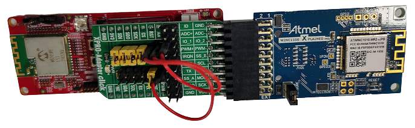
  - The jumper settings in XPRO-ADAPTER click board is as shown above figure. Use Jumpers and Jumper wires to connect the header as mentioned in below table.

	|Jumper Connections|
	| :- |
	|J3.1 &emsp; to &emsp; J4.1 |
	|J3.3 &emsp; to &emsp; J1.5 |
	|J3.5 &emsp; to &emsp; J3.6 |
	|J3.7 &emsp; to &emsp; J3.8 |
	|J3.9 &emsp; to &emsp; J3.10|
	|J3.11&emsp; to &emsp; J3.12|
	|J4.1 &emsp; to &emsp; J3.1 |
	|J4.3 &emsp; to &emsp; J4.4 |
	|J4.6 &emsp; Open |
	|J4.8 &emsp; Open |
	|J4.10&emsp; Open |
	|J4.12&emsp; Open |

## 4. Software Setup<a name="step4">

This project has been verified to work with the following versions of software tools:

- MPLAB X IDE v6.00
- XC32 Compiler v4.10
- MPLAB® Code Configurator v5.1.17
- PIC32CX-BZ\_DFP v1.0.107
- MCC Harmony
  - csp version: v3.13.1
  - core version: v3.11.1
  - wireless\_pic32cxbz\_wbz: v1.0.0
  - wireless\_ble: v1.0.0
  - zlib: v1.2.11
  - wireless\_wifi version: v3.6.1
  - dev\_packs version: v3.13.1
  - wolfssl: v4.7.0
  - crypto: v3.7.6
  - CMSIS-FreeRTOS version: v10.4.6

Refer Project Manifest present in harmony-manifest-success.yml under the project folder *firmware\src\config\default\harmony-manifest-success.yml* for more details

- Any Serial Terminal application like Tera Term terminal application.
	- configure the serial settings as follows:
		- Baud : 115200
		- Data : 8 Bits
		- Parity : None
		- Stop : 1 Bit
		- Flow Control : None

Because Microchip regularly update tools, occasionally issue(s) could be discovered while using the newer versions of the tools. If the project doesn’t seem to work and version incompatibility is suspected, It is recommended to double-check and use the same versions that the project was tested with. To download original version of MPLAB Harmony v3 packages, refer to document [How to Use the MPLAB Harmony v3 Project Manifest Feature](https://microchip.com/DS90003305)

## 5. Harmony MCC Configuration<a name="step5">

- The "MCC - Harmony Project Graph" below depicts the harmony components utilized in this project.\
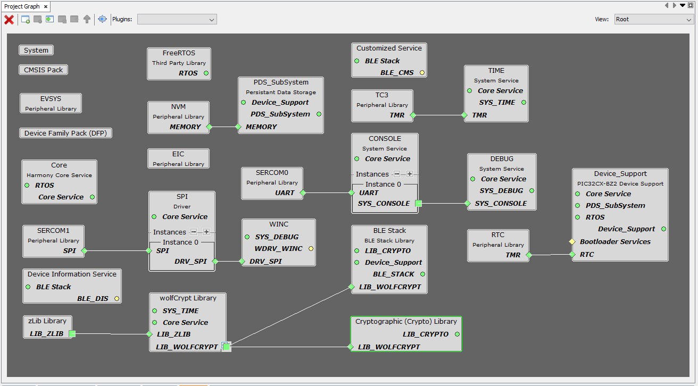

- The system configuration is depicted as follows.\
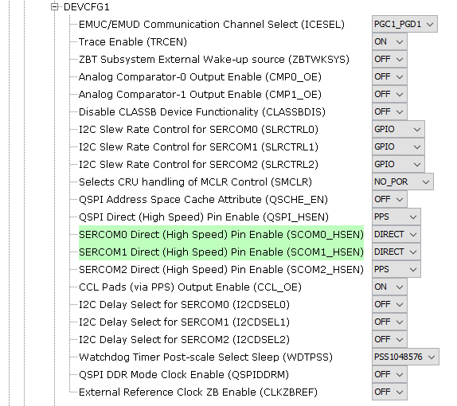\
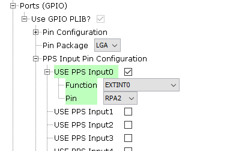

- The EIC configuration is depicted as follows.\
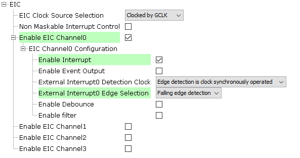

- The WINC configuration is depicted as follows.\

- The SPI Driver configuration is depicted as follows.\

- The SERCOM1 SPI configuration is depicted as follows.\
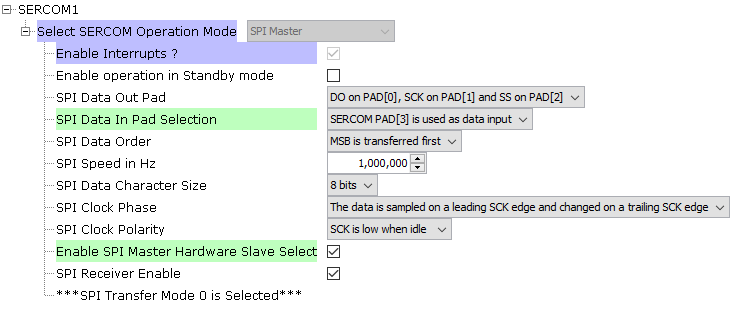

- The SERCOM0 UART configuration is depicted as follows.\
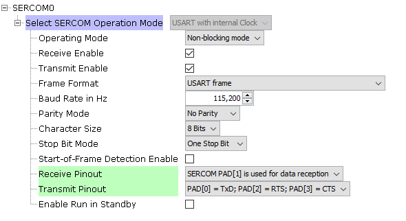

- The PIN configuration is depicted as follows.\
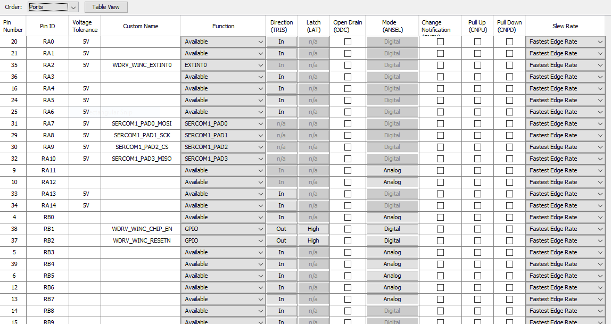

- The BLE Configuration is depicted as follows.\
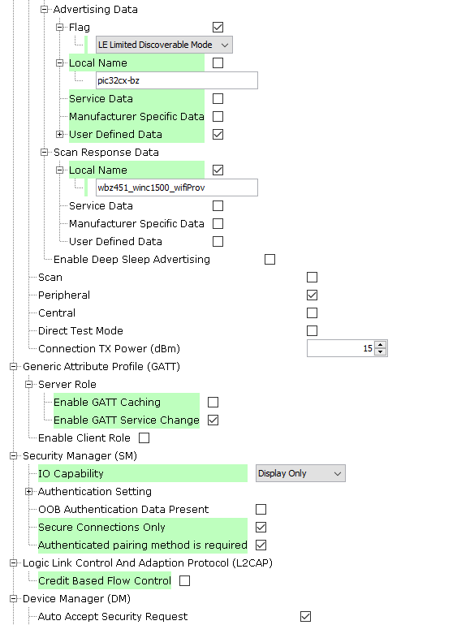

- The below figure shows configurations used in custom service component.
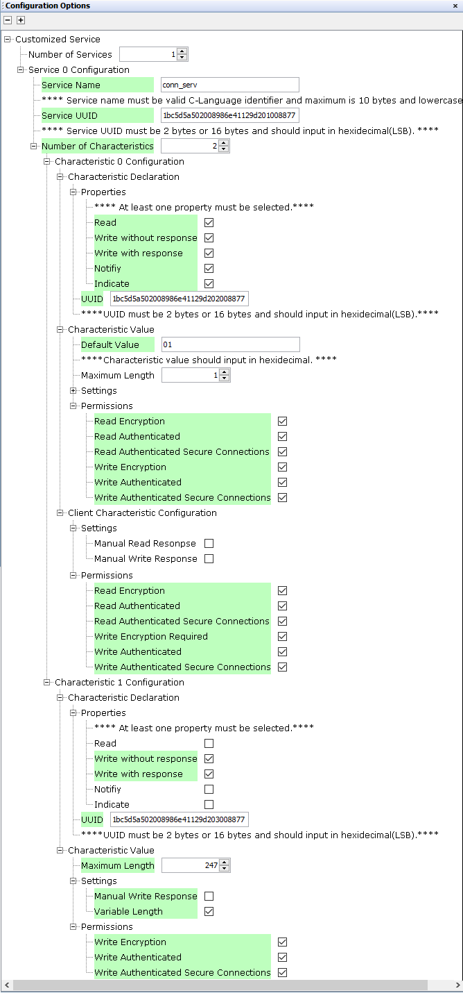

## 6. Run the demo<a name="step6">

- On startup, WBZ451 will Advertize with local name *wbz451_winc1500_wiifiProv*
- Open the Tera Term terminal application on your PC. The WBZ451 will show the welcome message in Tera Term after intialization as shown below.\
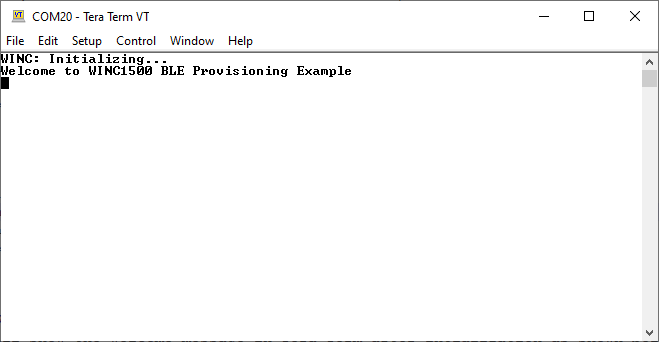
- Open MBD app in iPhone, touch on *BLE Provisioning* and touch on *WINC3400*.
- The MBD app will scan for ble advertising device and will display the device wbz451_winc1500_wifiProv as shown below.\
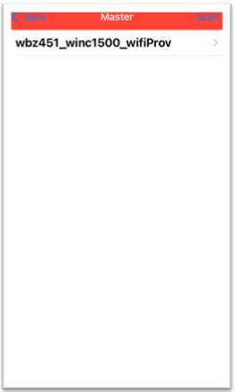
- Select *wbz451_winc1500_wiifiProv* to connect with *wbz451_winc1500_wiifiProv* device.
- The console log in tera term will display the Bluetooth pairing pass code as shown below.\
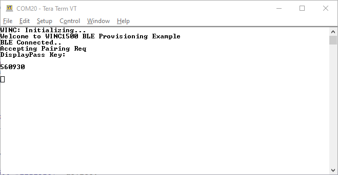
- In MBD App, Enter the pairing pass code as shown below.\
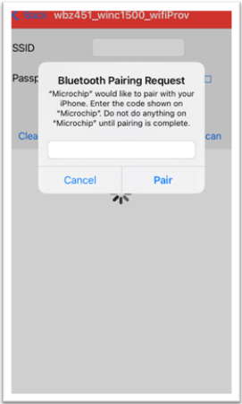
- When pairing is sucessfully completed, the console log in Tera Tem will show a success message as shown below.\
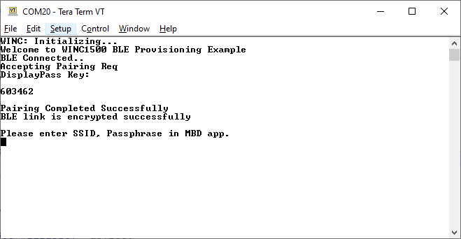
- Enter the SSID, Passphrase and select Wi-Fi Authentication Type. (In this example, the iPhone only supports "Open" and "WPA". On the Android phone, only "Open" is supported.)\
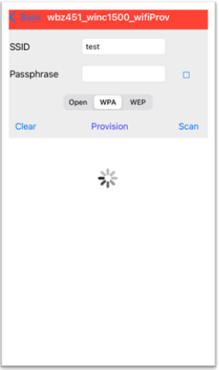
- Press *provision* button. Now the MBD app will send the Wi-Fi Provisionig credentials to WBZ451 device. WBZ451 will disconnect BLE connections then intialize WINC1500 and connect to the AP.
- Once connected, the device's IP address will be displayed in the Tera Term console log as shown below.\
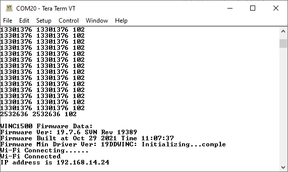

<a href="#top">Back to top</a>

