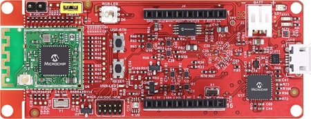

# PIC32CXBZ2_WBZ45x_BLE_WINC1500

> "Wireless Made Easy!" - These example applications add Wi-Fi connectivity to a BLE+15.4 capable device

Devices: **| PIC32CXBZ2 | WBZ45x |** 
Features: **| BLE | Wi-Fi |**

## ⚠ Disclaimer

<b>
THE SOFTWARE ARE PROVIDED "AS IS" AND GIVE A PATH FOR SELF-SUPPORT AND SELF-MAINTENANCE. This repository contains example code intended to help accelerate client product development.  

For additional Microchip repos, see: <a href="https://github.com/Microchip-MPLAB-Harmony" target="_blank">https://github.com/Microchip-MPLAB-Harmony</a>

Checkout the <a href="https://microchipsupport.force.com/s/" target="_blank">Technical support portal</a> to access our knowledge base, community forums or submit support ticket requests.

</b>

## Description

The PIC32CXBZ2 / WBZ45x SoC/Module enables IOT (Internet of Things) wireless connectivity by providing a low power SoC that provides BLE 5.1 along with IEEE 802.15.4 (Zigbee) in a single SoC. The WBZ45x module enables users to interact with Bluetooth or IEEE 802.15.4 (Zigbee) networks.

This package explains how to interface a WINC1500 device to a WBZ45x module so that the user's application can support Wi-Fi connectivity also.

## Contents

1. [Serial Bridge Application to update WINC1500 Firmware](01_wbz45x_winc1500_serialBridge#top)
   1. [Introduction](01_wbz45x_winc1500_serialBridge/README.md#step1)
   1. [Bill of materials](01_wbz45x_winc1500_serialBridge/README.md#step2)
   1. [Hardware Setup](01_wbz45x_winc1500_serialBridge/README.md#step3)
   1. [Software Setup](01_wbz45x_winc1500_serialBridge/README.md#step4)
   1. [Harmony MCC Configuration](01_wbz45x_winc1500_serialBridge/README.md#step5)
   1. [Run the demo](01_wbz45x_winc1500_serialBridge/README.md#step6)
1. [Wi-Fi Access Point Scan](02_wbz45x_winc1500_apScan/README.md#top)
   1. [Introduction](02_wbz45x_winc1500_apScan/README.md#step1)
   1. [Bill of materials](02_wbz45x_winc1500_apScan/README.md#step2)
   1. [Hardware Setup](02_wbz45x_winc1500_apScan/README.md#step3)
   1. [Software Setup](02_wbz45x_winc1500_apScan/README.md#step4)
   1. [Harmony MCC Configuration](02_wbz45x_winc1500_apScan/README.md#step5)
   1. [Run the demo](02_wbz45x_winc1500_apScan/README.md#step6)
1. [Wi-Fi Provisioning over BLE](03_wbz45x_winc1500_wifiProv/README.md#top)
   1. [Introduction](03_wbz45x_winc1500_wifiProv/README.md#step1)
   1. [Bill of materials](03_wbz45x_winc1500_wifiProv/README.md#step2)
   1. [Hardware Setup](03_wbz45x_winc1500_wifiProv/README.md#step3)
   1. [Software Setup](03_wbz45x_winc1500_wifiProv/README.md#step4)
   1. [Harmony MCC Configuration](03_wbz45x_winc1500_wifiProv/README.md#step5)
   1. [Run the demo](03_wbz45x_winc1500_wifiProv/README.md#step6)
1. [MQTT Client Chat Demo](04_wbz45x_winc1500_mqtt/README.md#top)
   1. [Introduction](04_wbz45x_winc1500_mqtt/README.md#step1)
   1. [Bill of materials](04_wbz45x_winc1500_mqtt/README.md#step2)
   1. [Hardware Setup](04_wbz45x_winc1500_mqtt/README.md#step3)
   1. [Software Setup](04_wbz45x_winc1500_mqtt/README.md#step4)
   1. [Harmony MCC Configuration](04_wbz45x_winc1500_mqtt/README.md#step5)
   1. [Run the demo](04_wbz45x_winc1500_mqtt/README.md#step6)

<a href="#top">Back to top</a>